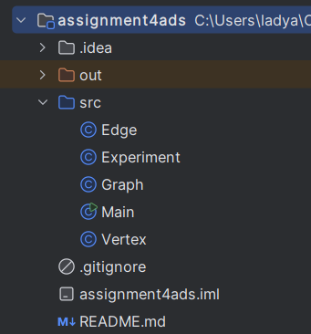
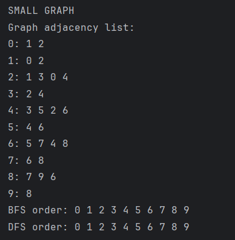
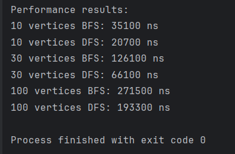

# Graph Traversal and Representation System

## Project Overview

This project is a Java program that represents a graph and performs graph traversal using two algorithms: Breadth-First Search (BFS) and Depth-First Search (DFS).

A graph consists of vertices and edges. A vertex is a node in the graph, and an edge is a connection between two vertices.

In this project, the graph is represented using an adjacency list. Each vertex stores a list of vertices connected to it. The graph is undirected, so when an edge is added between two vertices, the connection is stored in both directions.

The program creates graphs with different sizes, runs BFS and DFS, and measures the execution time using System.nanoTime().

---

## Project Structure

assignment4ads/  
├── src/  
│   ├── Vertex.java  
│   ├── Edge.java  
│   ├── Graph.java  
│   ├── Experiment.java  
│   └── Main.java  
├── README.md  
└── .gitignore

---

## Graph Representation

The graph is represented using an adjacency list.

An adjacency list stores each vertex together with the list of vertices connected to it.

Example:

0: 1 2  
1: 0 2  
2: 1 3 0 4

This means that vertex 0 is connected to vertices 1 and 2.

This representation is simple and efficient because it stores only existing connections.

---

## Classes

### Vertex

The Vertex class represents one node in the graph.

It has one private field:

private int id;

The class also has a constructor, a getter, and a toString() method.

The id is used as a unique identifier for each vertex.

### Edge

The Edge class represents a connection between two vertices.

It has two private fields:

private Vertex source;  
private Vertex destination;

The source is the starting vertex, and the destination is the ending vertex.

The class also has a constructor, getter methods, and a toString() method.

### Graph

The Graph class stores the graph structure.

It uses two HashMaps:

private HashMap<Integer, Vertex> vertices;  
private HashMap<Integer, ArrayList<Integer>> adjacencyList;

The vertices map stores all vertices by their id.

The adjacencyList map stores the connections between vertices.

| Method | Purpose |
|---|---|
| addVertex(Vertex v) | Adds a vertex to the graph |
| addEdge(int from, int to) | Adds an edge between two vertices |
| printGraph() | Prints the adjacency list |
| bfs(int start) | Runs BFS traversal and prints the order |
| dfs(int start) | Runs DFS traversal and prints the order |
| bfsSilent(int start) | Runs BFS without printing for time measurement |
| dfsSilent(int start) | Runs DFS without printing for time measurement |

The silent methods are used only for measuring execution time. They keep the output clean.

### Experiment

The Experiment class runs tests for different graph sizes.

It creates three graphs:

| Graph Type | Number of Vertices |
|---|---:|
| Small graph | 10 |
| Medium graph | 30 |
| Large graph | 100 |

For each graph, it runs BFS and DFS and measures the execution time.

The time is measured using:

long start = System.nanoTime();  
long end = System.nanoTime();

The final execution time is:

end - start

### Main

The Main class starts the program.

It creates an Experiment object and runs all tests.

---

## Breadth-First Search

Breadth-First Search, or BFS, visits vertices level by level.

It starts from one vertex, then visits all of its neighbors, then moves to the next level of neighbors.

BFS uses a queue.

### BFS Steps

- Choose a starting vertex.
- Mark it as visited.
- Add it to the queue.
- Remove one vertex from the queue.
- Visit all unvisited adjacent vertices.
- Add unvisited neighbors to the queue.
- Repeat until the queue is empty.

### BFS Use Cases

BFS is useful when we need to find the shortest path in an unweighted graph.

It can also be used in maps, social networks, and problems where nearby connections should be checked first.

### BFS Time Complexity

BFS time complexity is O(V + E).

V is the number of vertices.  
E is the number of edges.

Each vertex is visited once, and each edge is checked during traversal.

---

## Depth-First Search

Depth-First Search, or DFS, goes as deep as possible before returning back.

In this project, DFS is implemented using recursion.

### DFS Steps

- Choose a starting vertex.
- Mark it as visited.
- Go to one unvisited adjacent vertex.
- Continue going deeper.
- Return back when there are no unvisited adjacent vertices.
- Repeat until all reachable vertices are visited.

### DFS Use Cases

DFS is useful for exploring paths, checking connectivity, detecting cycles, and working with tree-like structures.

### DFS Time Complexity

DFS time complexity is O(V + E).

DFS visits each vertex once and checks each edge during traversal.

---

## Experimental Results

The program was tested on graphs with 10, 30, and 100 vertices.

| Graph Size   |  BFS Time |  DFS Time |
| ------------ | --------: | --------: |
| 10 vertices  |  35100 ns |  20700 ns |
| 30 vertices  | 126100 ns |  66100 ns |
| 100 vertices | 271500 ns | 193300 ns |

---

## Output Example

SMALL GRAPH

Graph adjacency list:

0: 1 2  
1: 0 2  
2: 1 3 0 4  
3: 2 4  
4: 3 5 2 6  
5: 4 6  
6: 5 7 4 8  
7: 6 8  
8: 7 9 6  
9: 8

BFS order: 0 1 2 3 4 5 6 7 8 9  
DFS order: 0 1 2 3 4 5 6 7 8 9

Performance results:

10 vertices BFS: 37300 ns  
10 vertices DFS: 21200 ns  
30 vertices BFS: 92500 ns  
30 vertices DFS: 63500 ns  
100 vertices BFS: 288400 ns  
100 vertices DFS: 153000 ns

---

## Analysis

As the graph size increased, the execution time also increased.

In my experiment, DFS was faster than BFS for all tested graph sizes. However, this does not mean that DFS is always faster. The result can depend on the graph structure, number of edges, implementation details, and system conditions.

Both BFS and DFS have the same theoretical time complexity: O(V + E).

The results match this complexity because the running time grows when the number of vertices and edges grows.

The traversal order depends on how the edges are added to the graph. In this project, BFS and DFS produced the same order for the small graph because the graph structure was simple and the vertices were connected in order.

---

## When BFS is Preferred

BFS is preferred when we need to find the shortest path in an unweighted graph.

Examples:

- finding the minimum number of steps
- checking nearby connections first
- searching in maps
- searching in social networks

---

## Limitations of DFS

DFS can go very deep in large graphs.

If recursion is used, DFS may use a lot of memory when the graph is very large.

DFS also does not always find the shortest path.

---

## Screenshots

### Project Structure

### Graph Structure and Traversal Output

### Performance Results

---

## Reflection

During this assignment, I learned how to represent a graph using an adjacency list. I understood that each vertex can store a list of its connected vertices.

I also learned the difference between BFS and DFS. BFS uses a queue and visits vertices level by level. DFS uses recursion and goes deeper before returning back.

The main challenge was to avoid visiting the same vertex more than once. I solved this by using a visited structure. It helps prevent repeated visits and avoids problems when the graph contains cycles.

Another important part of the assignment was measuring execution time. The experiment showed that larger graphs usually require more time, which matches the expected complexity of O(V + E).

---

## Conclusion

This project shows how graph traversal works in Java.

The program can:

- create vertices
- add edges
- print the graph as an adjacency list
- run BFS
- run DFS
- measure execution time for different graph sizes

The experiment showed that BFS and DFS both work efficiently and follow the expected time complexity of O(V + E).
